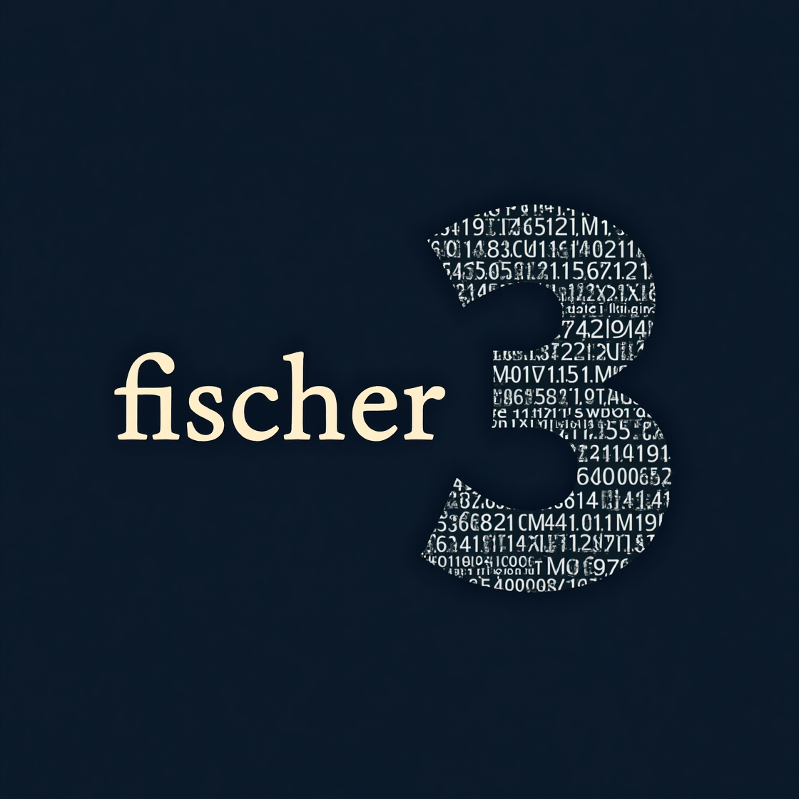

# fischer³ Agentic AI Security Education

# Agentic AI Security

**Practical, hands-on education for building secure AI agent systems**

[Get Started](#where-to-begin){ .md-button .md-button--primary }
[Browse by Topic](#what-this-project-covers){ .md-button }
[View Examples](#hands-on-examples){ .md-button }

---

## Welcome

AI agents are no longer a concept on the horizon — they are here, and they are talking to each other. The Agent-to-Agent (A2A) protocol, the Model Context Protocol (MCP), and the systems that tie them together represent a new frontier in software architecture. With that frontier comes a new set of security challenges that most existing resources barely touch.

This project exists because the security of agentic AI systems deserves the same rigorous, hands-on treatment we give to application security — but almost nobody is teaching it that way yet. You won't find a glossy overview and a "good luck" here. Instead, you'll find deliberately vulnerable code, real threat models, progressive security implementations, and the explanations that connect all the dots. Whether you're a developer building your first agent, a security professional evaluating an AI system, or an architect designing something that needs to work at production scale, this material was built with you in mind.

The core philosophy is simple: **you learn security best by seeing what happens when it's missing.** Every example in this project starts from an insecure baseline and evolves through increasingly robust implementations. By the time you reach the production-ready stages, you won't just know *what* to do — you'll understand *why* each control exists and *what* breaks without it.

---

## What This Project Covers

-   :material-shield-check:{ .lg .middle } __A2A Protocol Security__

    ---

    The Agent-to-Agent protocol is the backbone of multi-agent communication. This project provides deep dives into A2A fundamentals, agent identity and discovery, authentication mechanisms, threat modeling, and a full eight-layer validation framework.

    [:octicons-arrow-right-24: A2A Summary](a2a_summary.md)

-   :material-toolbox:{ .lg .middle } __Model Context Protocol (MCP)__

    ---

    MCP is how agents connect to the tools and resources they need. Learn how the protocol works, how to build servers and clients, and how to think about security at the agent-tool boundary.

    [:octicons-arrow-right-24: MCP Summary](mcp_summary.md)

-   :material-lan-connect:{ .lg .middle } __Integration & Architecture__

    ---

    A2A and MCP don't exist in isolation. Learn how these protocols work together, what architectural patterns emerge in real multi-agent systems, and where the security boundaries live.

    [:octicons-arrow-right-24: Integration Summary](integration_summary.md)

-   :material-presentation:{ .lg .middle } __Security Frameworks & Training__

    ---

    Professional presentation materials built around the eight-layer validation framework and a comprehensive three-stage security analysis. Designed for security reviews, team training, and executive briefings.

    [:octicons-arrow-right-24: Presentations](presentations/index.md)

---

## Where to Begin

The right starting point depends on your background and what you're trying to accomplish.

### New to Agentic AI?

Start here if you're unfamiliar with how AI agents communicate and collaborate, or if you want a grounded understanding before diving into security specifics.

1. **[A2A Overview](a2a/00_A2A_OVERVIEW.md)** — What agent-to-agent communication is and why it matters
2. **[Core Concepts](a2a/01_FUNDAMENTALS/01_core_concepts.md)** — The building blocks of A2A systems
3. **[MCP Summary](mcp_summary.md)** — How agents connect to tools
4. **[Integration Summary](integration_summary.md)** — How A2A and MCP fit together

**Estimated time: 2–3 hours**

### A Developer Ready to Build

You understand the basics and want to build agents that are secure from the start. This path gets you to production-ready patterns efficiently.

1. **[A2A Overview](a2a/00_A2A_OVERVIEW.md)** — Quick orientation
2. **[Security Best Practices](a2a/03_SECURITY/04_security_best_practices.md)** — The controls that matter most
3. **[Message Validation Patterns](a2a/04_COMMUNICATION/04_message_validation_patterns.md)** — Eight-layer defense in depth
4. **[MCP Fundamentals](mcp_fundamentals.md)** — Protocol mechanics for tool integration
5. **[Hands-On Examples](#hands-on-examples)** — See it all in working code

**Estimated time: 4–6 hours**

### A Security Professional Evaluating Agentic Systems

You need to understand the threat landscape, identify weaknesses, and know what good looks like. This path is built around exactly that workflow.

1. **[Threat Model](a2a/03_SECURITY/03_threat_model.md)** — What attacks actually look like against agent systems
2. **[Authentication Tags](a2a/03_SECURITY/02_authentication_tags.md)** — How cryptographic verification works in A2A
3. **[Code Walkthrough](a2a/03_SECURITY/05_code_walkthrough_comparison.md)** — Vulnerable vs. secure, side by side
4. **[Session State Security](a2a/03_SECURITY/06_session_state_security.md)** — A frequently overlooked attack surface
5. **[Security Checklist](presentations/agent_security_article_enhanced/security_checklist.md)** — 200+ item audit tool

**Estimated time: 6–8 hours**

### Not a Technical Professional

You don't write code, but you need to understand what's at stake when organizations deploy AI agents — and how to ask the right questions.

1. **[AI Collaboration Fundamentals](non-technical/01_fundamentals/AI_Collaboration_Fundamentals.md)** — No code required
2. **[Security for Non-Technical Audiences](non-technical/02_security/Security_for_Non_Technical_Audiences.md)** — Risk in plain language
3. **[Agent Security Article](presentations/agent-security/agent_security_article_enhanced.md)** — The executive summary and business case sections

**Estimated time: 2 hours**

---

## Hands-On Examples

Each example follows the same pattern: start with an intentionally vulnerable implementation, then progressively harden it stage by stage. By comparing stages, you see exactly what each security control buys you — and what happens without it.

-   :material-currency-btc:{ .lg .middle } __Cryptocurrency Price Agent__

    ---

    A multi-agent system for querying crypto prices. Stage 1 has no security. Stage 2 adds a registry and basic authentication. Stage 3 reaches production-ready security. Clean and focused — great for learning the fundamentals.

    [:octicons-arrow-right-24: Explore](../examples/a2a_crypto_example/)

-   :material-file-document:{ .lg .middle } __Credit Report Agent__

    ---

    An agent that handles sensitive file-based data. Demonstrates file handling vulnerabilities, input validation, and secure data processing. Includes an AI integration stage that introduces prompt injection as an attack vector.

    [:octicons-arrow-right-24: Explore](../examples/a2a_credit_report_example/)

-   :material-checkbox-multiple-marked:{ .lg .middle } __Task Collaboration System__

    ---

    A multi-agent task management system with 25+ documented vulnerabilities in Stage 1. Covers session management, distributed systems with Redis, and web framework integration with Flask and JWT. The most comprehensive single example in the project.

    [:octicons-arrow-right-24: Explore](../examples/a2a_task_collab_example/)

-   :material-robot-attack:{ .lg .middle } __Adversarial Agent__

    ---

    An agent specifically designed to attack other agents. Stage 1 shows five attack types that succeed. Stage 2 adds partial defenses. Stage 3 implements automated threat detection and quarantine. Essential reading for anyone thinking about adversarial scenarios.

    [:octicons-arrow-right-24: Explore](../examples/a2a_adversarial_agent_example/)

### MCP Examples

-   :material-database:{ .lg .middle } __MCP Client with SQLite__

    ---

    A complete MCP client and server example using a SQLite database for contact management. Uses the Gemini API and demonstrates the full MCP connection lifecycle in a practical context.

    [:octicons-arrow-right-24: Explore](../mcp_examples/mcp_client_w_sql_lite/)

-   :material-cloud-upload:{ .lg .middle } __Your First MCP Server__

    ---

    A step-by-step tutorial for building your first MCP server. Includes a simple weather tool, a test client, and no API key required for initial testing. The best place to start if you're new to MCP.

    [:octicons-arrow-right-24: Explore](../mcp_examples/your_first_mcp_server/)

---

## The Eight-Layer Security Framework

A recurring theme throughout this project is defense in depth — the idea that no single security control is sufficient on its own. The eight-layer framework provides a structured way to think about this:

| Layer | Control | What It Prevents |
|-------|---------|-----------------|
| 1 | Transport Security (TLS 1.3) | Eavesdropping and interception |
| 2 | Authentication | Impersonation and identity fraud |
| 3 | Session Management | Hijacking and state manipulation |
| 4 | Authorization (RBAC) | Unauthorized access to operations |
| 5 | Message Integrity (HMAC) | Tampering with messages in transit |
| 6 | Replay Protection | Reuse of captured messages |
| 7 | Rate Limiting | Brute-force and volume attacks |
| 8 | Input Validation | Injection, malformed payloads, and boundary violations |

The [presentation materials](presentations/index.md) provide extensive training content around this framework, including a 200+ item security checklist, slide decks for team training and executive briefings, and a detailed article walking through all eight layers with real-world examples.

---

## Key Concepts at a Glance

**Agent Card** — A standardized identity declaration. Every agent in an A2A system publishes one, advertising its capabilities, supported protocols, and authentication requirements. Learn more in [Agent Cards](a2a/02_DISCOVERY/01_agent_cards.md).

**Agent Registry** — A discovery service where agents register themselves and other agents look them up by capability. Central to how multi-agent systems find and coordinate with each other. Learn more in [Registry Patterns](a2a/02_DISCOVERY/02_registry_patterns.md).

**MCP Server** — A process that exposes tools and resources to AI agents via the Model Context Protocol. Think of it as a secure adapter between an agent and an external system. Learn more in [MCP Fundamentals](mcp_fundamentals.md).

**Session State Security** — Managing the lifecycle and integrity of agent-to-agent sessions. This is one of the most overlooked attack surfaces in agentic systems, and one of the most thoroughly covered topics in this project. Learn more in [Session State Security](a2a/03_SECURITY/06_session_state_security.md).

---

## 🤝 Contributing

Contributions are welcome and encouraged.

- **Found a bug?** Open an issue on [GitHub](https://github.com/fischer3-net/agentic-security-education)
- **Want to contribute content?** Submit a pull request
- **Have questions?** Start a discussion
- **Found a security issue?** Report responsibly to robert@fischer3.org

Ways to help: improve documentation clarity, add new examples, report security findings, translate to other languages, or share your own implementations.

---

## 📝 License

This project is released under the MIT License.

---

## 📬 Contact

**Project Maintainer**: Robert Fischer  
**Email**: robert@fischer3.org

---

## Ready to Dive In?

[Start with A2A →](a2a/00_A2A_OVERVIEW.md){ .md-button .md-button--primary }
[Explore MCP →](mcp_summary.md){ .md-button }
[Browse Examples →](../examples/){ .md-button }
[Security Presentations →](presentations/index.md){ .md-button }

---

**Last Updated**: January 2026  
**Version**: 3.0  
**Status**: Active Development